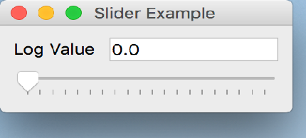

..
  NOTE: This RST file was generated by `make examples`.
  Do not edit it directly.
  See docs/source/examples/example_doc_generator.py

Slider Example
===============================================================================

An example of the ``Slider`` widget.

This example demonstrates the use of a simple ``Slider`` control which is
used to compute the log of a range of numbers.

.. TIP:: To see this example in action, download it from
 :download:`slider <../../../examples/widgets/slider.enaml>`
 and run::

   $ enaml-run slider.enaml

Screenshot
-------------------------------------------------------------------------------

Example Enaml Code
-------------------------------------------------------------------------------
.. literalinclude:: ../../../examples/widgets/slider.enaml
    :language: enaml
