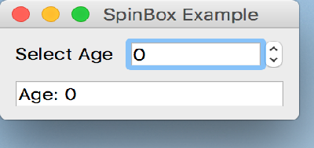

..
  NOTE: This RST file was generated by `make examples`.
  Do not edit it directly.
  See docs/source/examples/example_doc_generator.py

Spin Box Example
===============================================================================

An example of the ``SpinBox`` widget.

This example demonstrates the use of a simple ``SpinBox`` control which is
used to select from a discrete range of integer values.

.. TIP:: To see this example in action, download it from
 :download:`spin_box <../../../examples/widgets/spin_box.enaml>`
 and run::

   $ enaml-run spin_box.enaml

Screenshot
-------------------------------------------------------------------------------

Example Enaml Code
-------------------------------------------------------------------------------
.. literalinclude:: ../../../examples/widgets/spin_box.enaml
    :language: enaml
