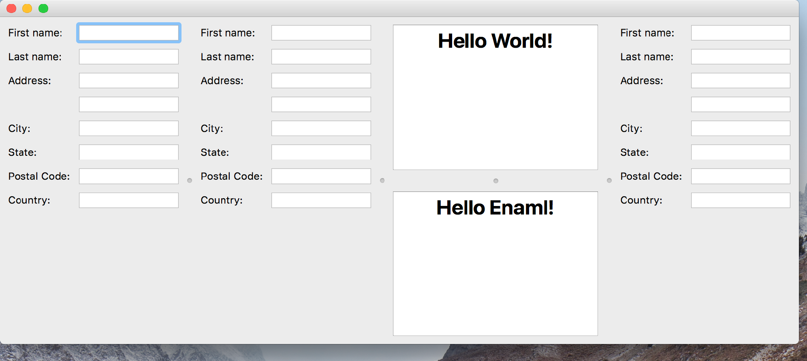

..
  NOTE: This RST file was generated by `make examples`.
  Do not edit it directly.
  See docs/source/examples/example_doc_generator.py

Splitter Example
===============================================================================

An example of the ``Splitter`` widget.

A ``Splitter`` is a widget which can hold an arbitrary number of children
which must be instances of ``Container``. The ``Splitter`` will separate
each ``Container`` with a bar which can be dragged by the user to change
the space allocated to the containers. This example shows how complex
arrangements can be acheived by nesting ``Splitter`` widgets inside
child ``Container`` widgets.

Implementation notes:

    The splitter support on Wx is poor. Certain behaviors, like initial
    splitter sizing does not work well (if at all). If a production
    application requires splitter support, prefer the Qt backend over
    Wx (this is generally a good life-rule).

.. TIP:: To see this example in action, download it from
 :download:`splitter <../../../examples/widgets/splitter.enaml>`
 and run::

   $ enaml-run splitter.enaml

Screenshot
-------------------------------------------------------------------------------

Example Enaml Code
-------------------------------------------------------------------------------
.. literalinclude:: ../../../examples/widgets/splitter.enaml
    :language: enaml
