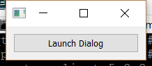

..
  NOTE: This RST file was generated by `make examples`.
  Do not edit it directly.
  See docs/source/examples/example_doc_generator.py

Task Dialog Example
===============================================================================

An example of using the Enaml stdlib task dialog components.

The ``task_dialog`` stdlib module provides a set of components which can be
easily assembled for a dialog which follows the style of the Windows 7/8
task dialogs.

A task dialog is assembled by declaring a ``TaskDialogBody`` element as the
child of a ``Dialog``. Within the body, the various special dialog area
containers can be declared to add content to the dialog. The dialog body
takes care of automatically laying the various areas.

This example creates a Dialog which uses all of the task dialog areas,
which is not a requirement for user code. In fact, all of the areas are
optional, and the developer is free to choose the bits needed for the
task at hand.

Creating a task dialog from scratch using the area elements is flexible,
but can be a bit tedious. For the more common use cases, Enaml provides
some predefined task dialogs. See `message_box.enaml` for an example.

.. TIP:: To see this example in action, download it from
 :download:`task_dialog <../../../examples/stdlib/task_dialog.enaml>`
 and run::

   $ enaml-run task_dialog.enaml

Screenshot
-------------------------------------------------------------------------------

Example Enaml Code
-------------------------------------------------------------------------------
.. literalinclude:: ../../../examples/stdlib/task_dialog.enaml
    :language: enaml
