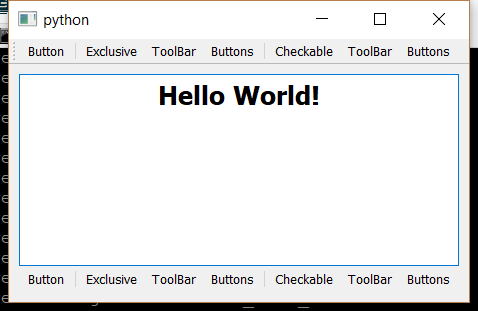

..
  NOTE: This RST file was generated by `make examples`.
  Do not edit it directly.
  See docs/source/examples/example_doc_generator.py

Tool Bar Example
===============================================================================

An example of the ``ToolBar`` widget.

This example demonstrates the use of the ``ToolBar`` widget. A ``ToolBar``
can have an arbitrary number of children, which must be ``Action`` widgets.
In this fashion, a ``ToolBar`` is very similar to a ``Menu`` in a ``MenuBar``.
The ``ToolBar`` also supports ``ActionGroup`` widgets in the same manner as
a ``Menu``. A ``ToolBar`` is typically used as a child of a ``MainWindow``,
but it can also used as a child of a ``Container`` and layed out using
constraints.

Implementation Notes:

    The tool bar facilities in Wx are very weak. Due to technical
    limitations, the ``ToolBar`` widget in Wx does not have the slick
    docking features which are available in Qt. It also does not
    look nice when used as the child of a ``Container``. If a ``ToolBar``
    is required for a particular application, strongly prefer the
    Qt backend over Wx (this is generally a good life-rule).

.. TIP:: To see this example in action, download it from
 :download:`tool_bar <../../../examples/widgets/tool_bar.enaml>`
 and run::

   $ enaml-run tool_bar.enaml

Screenshot
-------------------------------------------------------------------------------

Example Enaml Code
-------------------------------------------------------------------------------
.. literalinclude:: ../../../examples/widgets/tool_bar.enaml
    :language: enaml
