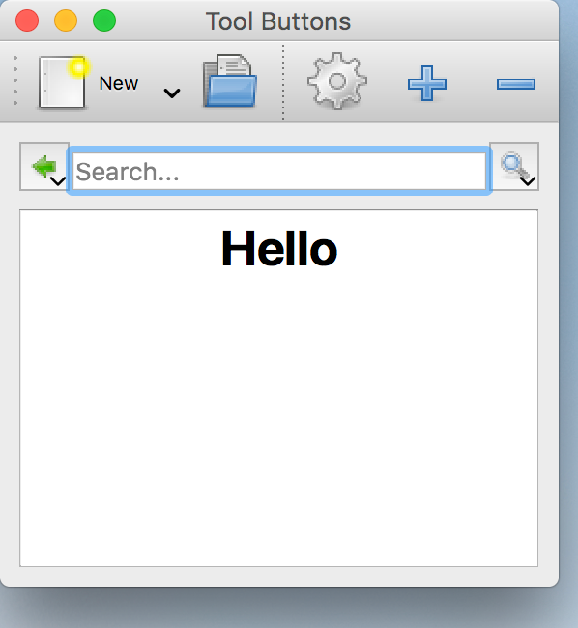

..
  NOTE: This RST file was generated by `make examples`.
  Do not edit it directly.
  See docs/source/examples/example_doc_generator.py

Tool Buttons Example
===============================================================================

An example demonstrating the use of ToolBar buttons.

This example shows how ToolBar buttons can be used both as children of
a ToolBar and as regular widgets in a Container. It also demonstrates
adding a menu to a ToolButton along with the various modes for
configuring popup behavior.

.. TIP:: To see this example in action, download it from
 :download:`tool_buttons <../../../examples/widgets/tool_buttons.enaml>`
 and run::

   $ enaml-run tool_buttons.enaml

Screenshot
-------------------------------------------------------------------------------

Example Enaml Code
-------------------------------------------------------------------------------
.. literalinclude:: ../../../examples/widgets/tool_buttons.enaml
    :language: enaml
