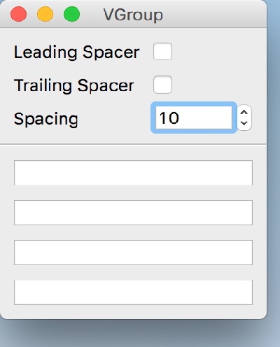

..
  NOTE: This RST file was generated by `make examples`.
  Do not edit it directly.
  See docs/source/examples/example_doc_generator.py

V Group Example
===============================================================================

An example of the ``VGroup`` convenience container.

The VGroup is a convenience container which provides a simple vertical
group of child widgets, with knobs to control inter-widget spacing and
leading and trailing spacers.

.. TIP:: To see this example in action, download it from
 :download:`v_group <../../../examples/widgets/v_group.enaml>`
 and run::

   $ enaml-run v_group.enaml

Screenshot
-------------------------------------------------------------------------------

Example Enaml Code
-------------------------------------------------------------------------------
.. literalinclude:: ../../../examples/widgets/v_group.enaml
    :language: enaml
