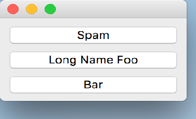

..
  NOTE: This RST file was generated by `make examples`.
  Do not edit it directly.
  See docs/source/examples/example_doc_generator.py

Vbox Example
===============================================================================

An example which demonstrates the use of the ``vbox`` layout helper.

In this example, we use the ``vbox`` layout helper to layout the children
of the Container in a vertical group. The ``vbox`` function is a fairly
sophisticated layout helper which automatically takes into account the
content boundaries of its parent. It also provides the necessary layout
spacers in the horizontal direction to allow for children of various
widths.

.. TIP:: To see this example in action, download it from
 :download:`vbox <../../../examples/layout/basic/vbox.enaml>`
 and run::

   $ enaml-run vbox.enaml

Screenshot
-------------------------------------------------------------------------------

Example Enaml Code
-------------------------------------------------------------------------------
.. literalinclude:: ../../../examples/layout/basic/vbox.enaml
    :language: enaml
