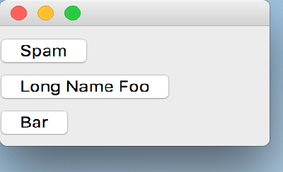

..
  NOTE: This RST file was generated by `make examples`.
  Do not edit it directly.
  See docs/source/examples/example_doc_generator.py

Vertical Example
===============================================================================

An example of the ``vertical`` layout helper.

This example uses the ``vertical`` layout helper to arrange a series of
``PushButton`` widgets in a vertical layout. No constraints are placed
on the horizontal position of the ``PushButton`` widgets so their
horizontal location in this example is non-deterministic.

.. TIP:: To see this example in action, download it from
 :download:`vertical <../../../examples/layout/basic/vertical.enaml>`
 and run::

   $ enaml-run vertical.enaml

Screenshot
-------------------------------------------------------------------------------

Example Enaml Code
-------------------------------------------------------------------------------
.. literalinclude:: ../../../examples/layout/basic/vertical.enaml
    :language: enaml
