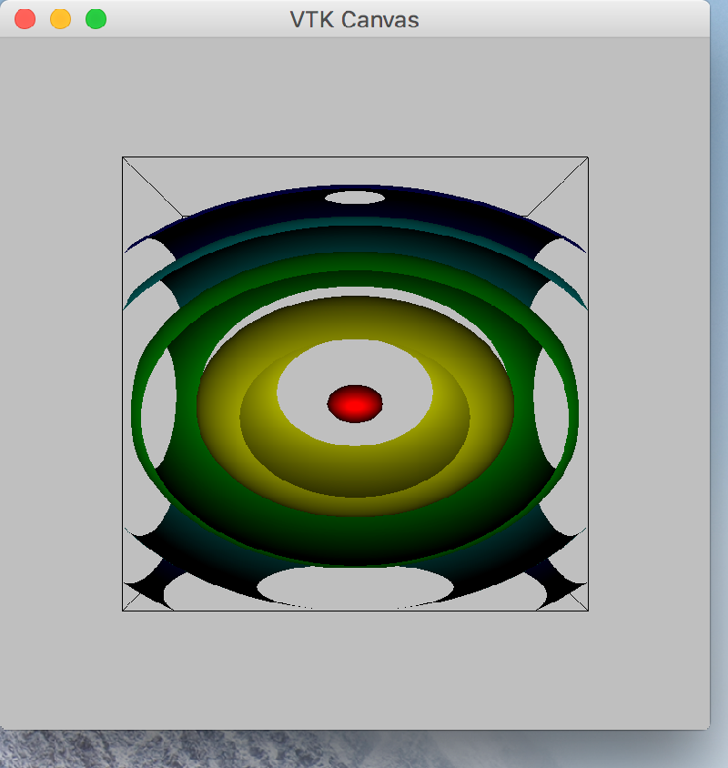

..
  NOTE: This RST file was generated by `make examples`.
  Do not edit it directly.
  See docs/source/examples/example_doc_generator.py

Vtk Canvas Example
===============================================================================

An example of the ``VTKCanvas`` widget.

Requires vtk to be installed.

.. TIP:: To see this example in action, download it from
 :download:`vtk_canvas <../../../examples/widgets/vtk_canvas.enaml>`
 and run::

   $ enaml-run vtk_canvas.enaml

Screenshot
-------------------------------------------------------------------------------

Example Enaml Code
-------------------------------------------------------------------------------
.. literalinclude:: ../../../examples/widgets/vtk_canvas.enaml
    :language: enaml
