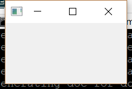

..
  NOTE: This RST file was generated by `make examples`.
  Do not edit it directly.
  See docs/source/examples/example_doc_generator.py

Window Example
===============================================================================

The 'Hello World' of Gui examples.

This example shows how to create a bare bones window with a title. For
this simple example, the ``Window`` has no children.

.. TIP:: To see this example in action, download it from
 :download:`window <../../../examples/widgets/window.enaml>`
 and run::

   $ enaml-run window.enaml

Screenshot
-------------------------------------------------------------------------------

Example Enaml Code
-------------------------------------------------------------------------------
.. literalinclude:: ../../../examples/widgets/window.enaml
    :language: enaml
