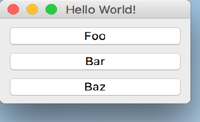

..
  NOTE: This RST file was generated by `make examples`.
  Do not edit it directly.
  See docs/source/examples/example_doc_generator.py

Window Children Example
===============================================================================

An example of using children with a ``Window`` widget.

The ``Window`` widget serves as the fundamental top level widget for UIs
in Enaml. ``Window`` widgets may have at most one child widget which must
be an instance of ``Container``. This ``Container`` is referred to as the
'central widget' of the UI. The sizing behavior of a ``Window`` is largely
determined by the sizing constraints of the central widget.

In this example, we use a ``Container`` and a few ``PushButton`` widgets to
add content to the ``Window``. Clicking on the first ``PushButton`` will
print the central widget of the window to the shell.

This example focuses on features of the ``Window`` widget, see the other
examples for explanations of the other widgets and language features.

.. TIP:: To see this example in action, download it from
 :download:`window_children <../../../examples/widgets/window_children.enaml>`
 and run::

   $ enaml-run window_children.enaml

Screenshot
-------------------------------------------------------------------------------

Example Enaml Code
-------------------------------------------------------------------------------
.. literalinclude:: ../../../examples/widgets/window_children.enaml
    :language: enaml
