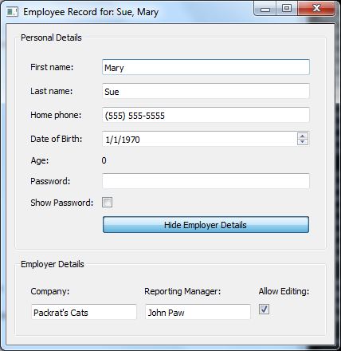

.. _tut_employee:

.. highlight:: enaml

Employee tutorial
==============================================================================

This tutorial shows how we can build more complex and dynamic user interfaces
based on Enaml. It introduces the concepts of constraints and validators. It
sets up a GUI to edit employee details.

Here is the Enaml file (:download:`download here
<../../../examples/tutorial/employee/employee_view.enaml>`):

.. literalinclude:: ../../../examples/tutorial/employee/employee_view.enaml
    :language: enaml

Here is the Python code (:download:`download here
<../../../examples/tutorial/employee/employee.py>`):

.. literalinclude:: ../../../examples/tutorial/employee/employee.py
    :language: python

Here is the Python code for the phone number validator (:download:`download here
<../../../examples/tutorial/employee/phone_validator.py>`):

.. literalinclude:: ../../../examples/tutorial/employee/phone_validator.py
    :language: python

``EmployeeForm`` Definition block
++++++++++++++++++++++++++++++++++++++++++++++++++++++++++++++++++++++++++++++

This block summarizes most of the concepts seen in the previous tutorial. It
creates a new ``enamldef`` based on the :py:class:`~enaml.widgets.form.Form`
widget. Two attributes are exposed in the widget: an ``employee`` attribute and
a ``show_employer`` boolean value that defaults to True. The form itself contains
a set of :py:class:`~enaml.widgets.label.Label` widgets with associated
:py:class:`~enaml.widgets.field.Field` widgets.

Using validation on fields
++++++++++++++++++++++++++++++++++++++++++++++++++++++++++++++++++++++++++++++

The ``"Home phone:"`` field must be validated to make sure the user can't insert
a phone number that is not valid. The user interface must also signal the user
when the current entry is invalid.

A ``PhoneNumberValidator`` class implements the ``validate(...)`` method of the
:py:class:`~enaml.validation.validator.Validator` abstract class. If the
validation succeeds the returned value of the validate call is standardized
formatted text.

.. literalinclude:: ../../../examples/tutorial/employee/phone_validator.py
    :language: python

In the ``Field`` definition, every time the text is updated with a properly
validated entry, the employee phone attribute is updated. ::

    Field:
        validator = PhoneNumberValidator()
        text << '(%s) %s-%s' % employee.phone
        text ::
            match = validator.proper.match(text)
            if match:
                area = match.group(1)
                prefix = match.group(2)
                suffix = match.group(3)
                employee.phone = tuple(map(int, (area, prefix, suffix)))

Dynamic interaction with widgets
++++++++++++++++++++++++++++++++++++++++++++++++++++++++++++++++++++++++++++++

The widget attributes all support the special Enaml operators. One can thus
assign the result of arbitrary Python code to interact with the status of the
widget::

   Label:
        text = 'Password:'
    Field:
        echo_mode << 'password' if not pw_cb.checked else 'normal'
        text :: print 'Password:', text
    Label:
        text = 'Show Password:'
    CheckBox: pw_cb:
        checked = False

In this example, the user can activate or deactivate the ``echo_mode`` of the
password Field based on the state of another widget, the password ``CheckBox``.
The user can refer to the password :py:class:`~enaml.widgets.check_box.CheckBox`
using the `id` of the widget.

Visibility is controled with the ``visible`` attribute of a widget. In the
``EmployeeMainView``, the ``btm_box`` visibility is connected to the
``top_form.show_employer`` attribute. Enaml will take care of the related
relayout issues. See the constraints section for more information.

The very same pattern is used in the ``EmployerForm`` to enable or disable a
group of ``Field`` widgets baesd on a ``CheckBox``.

Customizing your layout
++++++++++++++++++++++++++++++++++++++++++++++++++++++++++++++++++++++++++++++

Once you have created the components of your main view, you can assemble them
using the differeent containers:

 * :py:class:`~enaml.widgets.container.Container`,
 * :py:class:`~enaml.widgets.form.Form`,
 * :py:class:`~enaml.widgets.group_box.GroupBox`,

Those widgets take care of aranging the layout of the child widgets using a set
of constraints. In this tutorial, the only one that defines constraints is the
outer container::

    Container:
        constraints << [
            vertical(
                top, top_box, btm_box.when(btm_box.visible), spacer, bottom
            ),
            horizontal(left, spacer.flex(), top_box, spacer.flex(), right),
            horizontal(left, spacer.flex(), btm_box, spacer.flex(), right),
            align('midline', top_form, btm_form)
        ]

.. image:: images/tut_employee_layout.png

The constraints attribute of the :py:class:`~enaml.widgets.container.Container`
is populated with a list of constraints. The user expresses how he wants the
layout to be aranged:

 * a vertical constraint on the widgets named by id's.
 * two horizontal constraints on the widgets with spacers
 * a special constraint on the two forms that aligns their midline, the line
   between the two columns of the form. Note that we refer to the id's of the
   forms and not the ones of the ``GroupBox``. ``GroupBoxes`` do not have a
   ``midline`` attribute.

Using ``spacer``, you can add empty space between widgets. This space could
either be fixed  space or flexible when using ``spacer.flex()``. In this case,
the spacer will expose a weaker preference for being the fixed value. The
following set of constraints will make the first form compressed horizontally
by setting the target fixed size of the spacer to 50 pixels::

    Container:
        constraints << [
            vertical(
                top, top_box, btm_box.when(btm_box.visible), spacer, bottom
            ),
            horizontal(left, spacer(50).flex(), top_box, spacer(50).flex(), right),
            horizontal(left, spacer.flex(), btm_box, spacer.flex(), right),
            align('midline', top_form, btm_form)
        ]

Specialized containers can expose particular ways of managing their layout. The
:py:class:`~enaml.widgets.form.Form` exposes a ``midline`` attribute that can be
used to align the midline of different forms together. If it was not activated,
the layout would have been:

Tweaking the layout
******************************************************************************

Enaml provides many different ways of tweaking the constraints to make sure the
layout engine gives you exactly what you want.

A user can give a weight to each constraint. Valid weights are: ``'weak'``,
``'medium'``, ``'strong'`` and ``'ignore'``. If the user wants to make the width
of the container equal to 233 pixels but with some latitude, he could add the
following constraint::

    Container:
        constraints << [
            vertical(
                top, top_box, btm_box.when(btm_box.visible), spacer, bottom
            ),
            horizontal(left, spacer.flex(), top_box, spacer.flex(), right),
            horizontal(left, spacer.flex(), btm_box, spacer.flex(), right),
            align('midline', top_form, btm_form),
            (width == 233) | 'weak'
        ]

The :py:class:`~enaml.widgets.container.Container` exposes some content related
attributes to the constraints system: ``width``, ``height``, ``left``, ``right``,
``bottom``, ``top``, ``v_center`` and ``h_center``. They can be used as shown
in the previous example.

Depending on the flexiblity you need, you might want to use some of the other
layout function like ``hbox`` or ``vbox``. You could have created a layout
pretty close to this one with the following constraints::

    Container:
        constraints = [
            vbox(top_box, btm_box.when(btm_box.visible)),
            align('midline', top_form, btm_form)
        ]

The advantage of using ``hbox`` and ``vbox`` is that you can nest them. The
``vertical`` and ``horizontal`` functions cannot be nested.

The set of constraints can be nested by using the ``hbox``, ``vbox`` or by
providing constraints of containers that belongs to the outer container. The
:py:class:`~enaml.widgets.group_box.GroupBox` provides some internal constraints
regarding its size to allow the title to be properly displayed. A
:py:class:`~enaml.widgets.form.Form` automatically lays out the widgets in two
columns. If the user wanted to have an ``EmployerForm`` laid out in two horizontal
rows in place of two columns, he could have edited the ``EmployerForm`` with the
following set of changes:

- update the base class to be a ``Container`` instead of a ``Form``
- provide ids for each of the child widgets
- provide a list of constraints for the desired layout
- remove the alignment constraint in the main container

::

    enamldef EmployerForm(Container):
        attr employer
        constraints = [
            vbox(
                hbox(cmp_lbl, mng_lbl, edit_lbl),
                hbox(cmp_fld, mng_fld, en_cb),
            ),
            cmp_lbl.width == cmp_fld.width,
            mng_lbl.width == mng_fld.width,
            edit_lbl.width == en_cb.width,
        ]
        Label: cmp_lbl:
            text = "Company:"
        Field: cmp_fld:
            text << employer.company_name
            enabled << en_cb.checked
        Label: mng_lbl:
            text = "Reporting Manager:"
        Field: mng_fld:
            text << "%s %s" % (employer.first_name, employer.last_name)
            enabled << en_cb.checked
        Label: edit_lbl:
            text = "Allow Editing:"
        CheckBox: en_cb:
            checked = True

