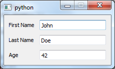
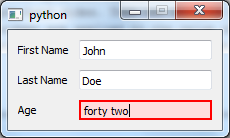
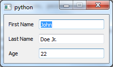

.. _tut_person:

.. highlight:: enaml

Person tutorial
===============================================================================

This tutorial expands on the :ref:`"Hello World" Tutorial <tut_hello_world>` to
introduce the concepts of reusable component declarations and components from
the standard widget library in Enaml. It sets up a GUI with the name and age
of a person.

Here is the Enaml file (:download:`download here
<../../../examples/tutorial/person/person_view.enaml>`):

.. literalinclude:: ../../../examples/tutorial/person/person_view.enaml
    :language: enaml

Here is the Python code (:download:`download here
<../../../examples/tutorial/person/person.py>`):

.. literalinclude:: ../../../examples/tutorial/person/person.py
    :language: python

The resulting GUI looks like this (on Windows 7):

Enaml Imports
+++++++++++++++++++++++++++++++++++++++++++++++++++++++++++++++++++++++++++++++

This ``.enaml`` file begins like the :ref:`"Hello World" <tut_hello_world>` example
with comments, but next we see that we can import other ``.enaml`` files in Enaml,
just like we can import ``.py`` files.::

    from enaml.stdlib.fields import IntField

In this case, we are importing the integer field widget ``IntField`` from
Enaml's standard widget library. This widget
lets us assign an integer to the ``value`` attribute of the widget. The
widget automatically converts to and from the ``text`` representation of the
integer complete with validation and error checking.

Note that this import points to a widget definition in an ``.enaml`` file.
*The import statement looks like Python but imports from an* ``.enaml`` *file.*

``PersonForm`` Definition Block
+++++++++++++++++++++++++++++++++++++++++++++++++++++++++++++++++++++++++++++++

Next, there is a **component definition** block. We define a component, in this
case an entry form, using a component hierarchy definition. With this block of
code, we define a reusable component derived from other components.

::

    enamldef PersonForm(Form):
        attr person
        Label:
            text = 'First Name'
        Field:
            text := person.first_name
        Label:
            text = 'Last Name'
        Field:
            text := person.last_name
        Label:
            text = 'Age'
        IntField:
            minimum = 0
            value := person.age

A component definition block header line begins with ``enamldef`` followed by
the name of the component followed by the base component or widget from which
it inherits. *A widget defined with* ``enamldef`` *must inherit from a builtin
widget or another* ``enamldef``. The header line ends with a colon::

    enamldef PersonForm(Form):

Indented under the header line are statements declaring either attributes or
children. ``attr person`` declares a ``person`` attribute of ``PersonForm``.
Because no default value is specified, this attribute must be supplied by code
which uses the ``PersonForm``.

Built-in Components
+++++++++++++++++++++++++++++++++++++++++++++++++++++++++++++++++++++++++++++++

Next, we add a series of labels and fields. ``Form``, ``Label`` and ``Field``
are all from the library of Enaml built-in widgets.

:py:class:`~enaml.widgets.form.Form` is a built-in container that arranges
alternating child components into two columns. This is typically done in the
way seen here with alternating ``Label`` and widget children, though there
are no restrictions on the types of widgets which can be used. In a form with
an odd number of components, the last component spans both columns.

:py:class:`~enaml.widgets.label.Label` is a built-in component for displaying
read-only text.

:py:class:`~enaml.widgets.field.Field` is a built-in widget for entering a text
value. Field is used as the base component for many other components that do
type conversions.

Delegation Operator :=
+++++++++++++++++++++++++++++++++++++++++++++++++++++++++++++++++++++++++++++++

In the ``Field`` code block, we notice a new operator ``:=``. This is the
delegation operator, one of the five special operators in
the Enaml grammar. It sets up a two-way synchronization
between the objects on the left-hand and right-hand sides. That is, changes to
the value of the ``text`` field in the GUI widget are applied to the value of
``person.first_name``, and changes to the value of ``person.first_name`` are
displayed in the GUI component.

Standard Library of Derived Components
+++++++++++++++++++++++++++++++++++++++++++++++++++++++++++++++++++++++++++++++

The ``IntField`` component is derived from ``Field`` and provides
string-to-integer conversion, validation, and error reporting functions. By
using the ``IntField`` component, we add validation to the GUI, as shown in the
example below, where a non-integer value was entered in the age field:

``PersonView`` Definitions Block
+++++++++++++++++++++++++++++++++++++++++++++++++++++++++++++++++++++++++++++++

Now, with another ``enamldef`` block, we can make a view available using our
previously declared ``PersonForm``. If we wanted to, we could add ``PersonForm``
many times over in this view or any other view, but for now we'll keep it
simple. Note that we will pass a ``person`` object to the view when we create
an instance of it.

::

    enamldef PersonView(Window):
        attr person
        PersonForm:
            person = parent.person

Now, on to the Python code.

Atom Object
-------------------------------------------------------------------------------

Enaml is designed to be model framework independent and ships with a formal
API for attaching to any Python model framework which provides notification of
state change. However, Enaml itself is built with Atom and will work
with `Atom objects <https://github.com/nucleic/atom/>`_ out of the
box. The important thing to note is that the ``Person`` attribute names match
the attribute names of the ``person`` object used by the ``PersonForm`` in the
.enaml file.
::

 class Person(Atom):
    """ A simple class representing a person object.

    """
    last_name = Str()

    first_name = Str()

    age = Range(low=0)

    debug = Bool(False)

    @observe('age')
    def debug_print(self, change):
        """ Prints out a debug message whenever the person's age changes.

        """
        if self.debug:
            templ = "{first} {last} is {age} years old."
            s = templ.format(
                first=self.first_name, last=self.last_name, age=self.age,
            )
            print s

Note that our ``Person`` class is designed to print out the name and age of the
person when the ``age`` attribute changes.

Hooking up an Enaml View to an Atom Object
+++++++++++++++++++++++++++++++++++++++++++++++++++++++++++++++++++++++++++++++

In the code block for launching the script from the command line, we create a
``Person`` object and create an application which serves it using the
``PersonView`` for the GUI::

    if __name__ == '__main__':
        with enaml.imports():
            from person_view import PersonView

        john = Person(first_name='John', last_name='Doe', age=42)
        john.debug = True

        app = QtApplication()
        view = PersonView(person=john)
        view.show()

        app.start()

Running it from the command line, we see

.. code-block:: shell

    $ python person.py

We can then make a change in the GUI and see::

    John Doe Jr. is 22 years old.

