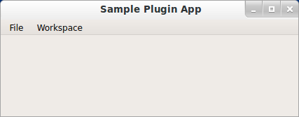
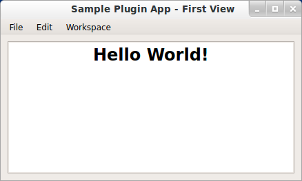
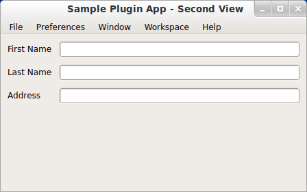
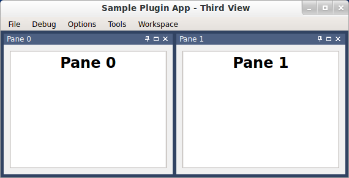

.. _wb_sample:

Sample Workbench Example
===============================================================================

Here is the Python entry point for the example (:download:`download here
<../../../examples/workbench/sample.py>`):

.. literalinclude:: ../../../examples/workbench/sample.py
    :language: python

The resulting GUI looks like this (on Ubuntu):

There are three workspaces available in the dropdown menu, which are loaded 
just prior to display.

