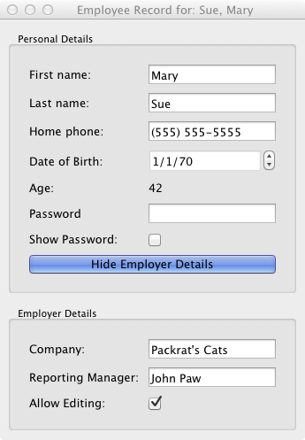

Employee Example
===============================================================================

:download:`employee_view.enaml <../../../examples/tutorial/employee/employee_view.enaml>`

.. literalinclude:: ../../../examples/tutorial/employee/employee_view.enaml
    :language: python

:download:`employee.py<../../../examples/tutorial/employee/employee.py>`

.. literalinclude:: ../../../examples/tutorial/employee/employee.py
    :language: python

::

    $ python employee.py

