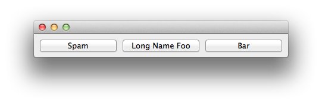

HboxEqualWidths Example
===============================================================================

:download:`hbox_equal_widths.enaml <../../../examples/layout/basic/hbox_equal_widths.enaml>`

.. literalinclude:: ../../../examples/layout/basic/hbox_equal_widths.enaml
    :language: python

::

 $ enaml-run hbox_equal_widths.enaml

