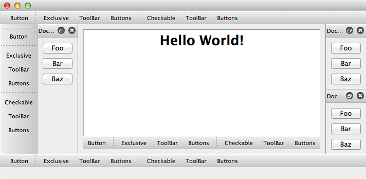

MainWindow Example
===============================================================================

:download:`main_window.enaml <../../../examples/widgets/main_window.enaml>`

.. literalinclude:: ../../../examples/widgets/main_window.enaml
    :language: python

::

 $ enaml-run main_window.enaml

