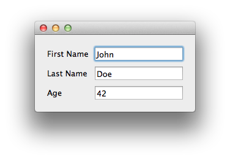

Person Example
===============================================================================

:download:`person_view.enaml <../../../examples/tutorial/person/person_view.enaml>`

.. literalinclude:: ../../../examples/tutorial/person/person_view.enaml
    :language: python

:download:`person.py<../../../examples/tutorial/person/person.py>`

.. literalinclude:: ../../../examples/tutorial/person/person.py
    :language: python

::

    $ python person.py

