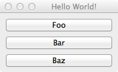

WindowChildren Example
===============================================================================

:download:`window_children.enaml <../../../examples/widgets/window_children.enaml>`

.. literalinclude:: ../../../examples/widgets/window_children.enaml
    :language: python

::

 $ enaml-run window_children.enaml

